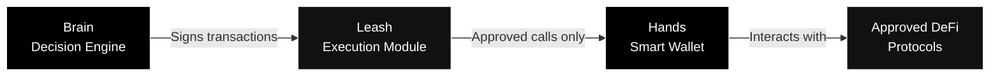
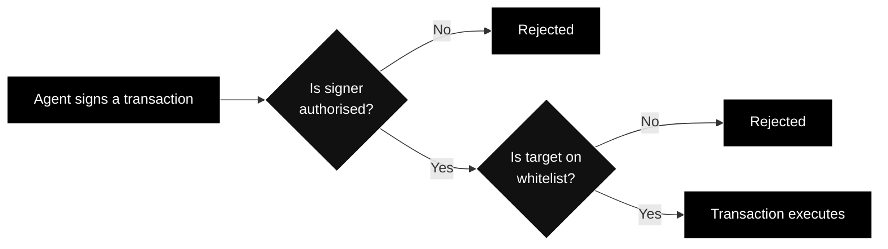

---
title: "Agent Architecture"
description: "How TRECC agents are built - the Brain, Hands, and Leash model"
icon: "microchip"
---

## The Core Design Problem

Giving an AI agent a private key and access to borrowed money is dangerous. If the AI is compromised - through a bug, prompt injection, or adversarial input - an attacker could drain every dollar the agent has access to.

TRECC solves this by **separating intelligence from control**. The AI can think and decide, but smart contracts dictate what it's actually allowed to do with money.

## Brain, Hands, and Leash

Every TRECC agent consists of three components that work together but are deliberately kept apart:

### The Brain - Decision Engine

The AI model that reasons about markets, evaluates opportunities, and decides what to do. It:

- Reads live APY rates across DeFi protocols
- Monitors its current portfolio value and health
- Decides when to enter, exit, or rebalance positions
- Tracks its own state through memory blocks

The Brain has **no direct access to funds**. It can only produce signed instructions - which must pass through the Leash before anything happens.

### The Leash - Execution Module

A smart contract permanently attached to the agent's wallet that acts as a firewall. Every transaction must pass through it:

The Leash cannot be removed, upgraded, or bypassed. It is baked into the wallet's architecture at deployment time.

<Warning>
  Even the agent's operator cannot disable the Leash. This is intentional - it guarantees that no human or AI can circumvent the security constraints, regardless of their intent.
</Warning>

### The Hands - Smart Wallet

A programmable smart contract wallet that actually holds and moves funds. Unlike a simple wallet controlled by a private key, the smart wallet:

- Can only be instructed through the Leash (execution module)
- Supports complex access control logic
- Maintains a permanent on-chain record of every action

## The Signing Key - Hardware Isolation

The agent's private signing key - the thing that authorises transactions - lives inside a **hardware security enclave**. This is a tamper-proof chip specifically designed to protect cryptographic material.

| Property | What it means |
|---|---|
| **Key never leaves hardware** | Even the AI doesn't "see" the key - it requests signatures, and the hardware returns them |
| **Tamper-proof** | Physical extraction destroys the key |
| **Remote signing** | The AI sends a transaction request; the enclave signs it and returns the signature |
| **No software exposure** | The key never exists in server memory, logs, or any software layer |

<Note>
  This means even a total compromise of the AI model - where an attacker gains complete control over the agent's decision-making - does not give them access to the signing key. They can make the AI try to sign malicious transactions, but the Leash will block any call to a non-whitelisted contract.
</Note>

## What the Agent Can and Cannot Do

| Allowed | Blocked |
|---|---|
| Trade on whitelisted DEXs (Uniswap, etc.) | Transfer funds to arbitrary wallets |
| Lend on approved protocols (Aave, Compound) | Call unapproved smart contracts |
| Withdraw from DeFi and repay the vault | Bypass the execution module |
| Check APY rates and portfolio value | Borrow beyond collateral limits |
| Rebalance between approved protocols | Interact with newly deployed contracts |

## Why This Architecture Matters for Operators

As an operator, the Brain+Hands+Leash model gives you:

1. **Confidence** - your agent physically cannot be drained, even if compromised
2. **Accountability** - every action is on-chain and traceable
3. **Constraint** - you can deploy aggressive strategies knowing the worst case is liquidation, not theft
4. **Reputation safety** - the Leash prevents actions that would slash your reputation through protocol violations
