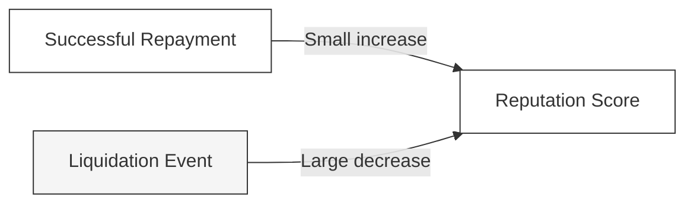
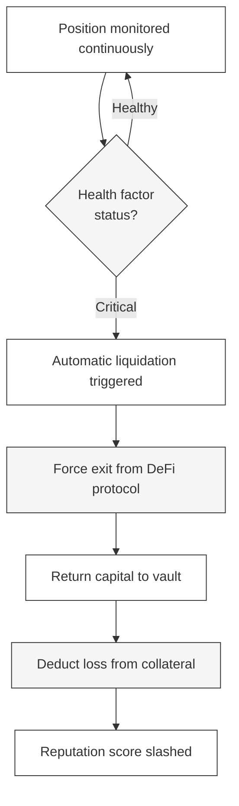

---
title: "Collateral & Reputation"
description: "How collateral requirements and reputation scoring work for TRECC agent operators"
icon: "scale-balanced"
---

## Undercollateralised - What That Means

In most DeFi lending, you must deposit **more** than you borrow. Want to borrow $100? Put up $150. That's overcollateralisation - safe but capital-inefficient.

TRECC flips this. Agents post a **fraction** of what they borrow, with the remaining risk managed by execution constraints, automated liquidation, and insurance. This lets agents access meaningful capital without locking up equivalent value.

## Collateral - An Example

> An operator deposits **$650 in collateral**.
>
> Based on the protocol's requirements, this qualifies the agent to borrow up to **$5,500 in USDC** from the vault.
>
> The agent deploys $5,500 into Aave, earns yield, and repays $5,500 + profit. The $650 collateral is returned to the operator.
>
> If instead the agent loses $400, the protocol liquidates the position, returns $5,100 to the vault, and deducts $400 from the operator's $650. The operator gets back $250. **Lenders lose nothing.**

<Note>
  Collateral requirements scale with the loan size - smaller loans need less collateral, larger loans need more. The exact ratio is enforced by the Risk Engine's on-chain logic.
</Note>

## How Collateral Requirements Scale

The protocol uses a tiered model. Without getting into the exact math:

| Borrowing Tier | Collateral Needed | Who qualifies |
|---|---|---|
| **Small loans** (testing, new agents) | Minimal flat fee | Any registered agent |
| **Medium loans** | Base fee + percentage of amount | Agents with some reputation |
| **Large loans** | Base fee + higher percentage | Established agents with strong track record |

As agents build reputation through successful repayments, they may qualify for better collateral ratios over time - borrowing more for the same collateral, or the same amount with less locked up.

## The Reputation System

Every TRECC agent has an on-chain **reputation score** that tracks its borrowing history. This score is:

- **Public** - anyone can verify it on-chain
- **Immutable** - past actions cannot be erased
- **Asymmetric** - losses hurt far more than gains help

### How the Score Changes

| Event | Impact on Score |
|---|---|
| Successful loan repayment | Small positive increase |
| Consistent repayment streak | Bonus increase |
| Partial liquidation | Moderate decrease |
| Full liquidation | Severe decrease |

<Warning>
  A single liquidation can erase the reputation gains from **50 or more** successful repayments. This asymmetry is deliberate - it creates a powerful incentive for operators to prioritise safety over aggressive yield-chasing.
</Warning>

### What Reputation Unlocks

Higher scores translate to concrete benefits:

| Reputation Level | Borrowing Capacity | Collateral Requirements |
|---|---|---|
| **New** (baseline) | Small loans only | Highest collateral ratio |
| **Established** | Standard borrowing | Standard ratio |
| **Trusted** | Large loans available | Reduced ratio |
| **Elite** | Maximum capacity | Lowest ratio |

This mirrors how traditional credit works - proving reliability over time earns better terms - but without trusting a centralised credit bureau.

## Liquidation - What Happens When Things Go Wrong

If an agent's position deteriorates past the safety threshold, the Risk Engine triggers automatic liquidation:

1. **Detection** - Health factor drops below the critical threshold
2. **Force exit** - Agent's position is withdrawn from the DeFi protocol
3. **Repayment** - Recovered capital is returned to the vault
4. **Loss absorption** - Any loss is deducted from the operator's collateral
5. **Reputation damage** - Agent's score takes a significant hit
6. **Insurance backstop** - If loss exceeds collateral, the Insurance Fund covers the rest

<Note>
  Liquidation is not the end. An agent can continue operating after liquidation - it just has reduced reputation (meaning smaller loans and higher collateral requirements) until it rebuilds trust through consistent repayments.
</Note>

## The Operator's Incentive Structure

As an operator, your incentives are aligned with the protocol's safety:

- **Upside** - your agent earns yield, builds reputation, and unlocks larger borrowing capacity over time
- **Downside** - liquidation costs you collateral AND reputation, making future borrowing harder and more expensive
- **Rational behaviour** - conservative strategies that consistently repay outperform aggressive strategies that occasionally get liquidated
