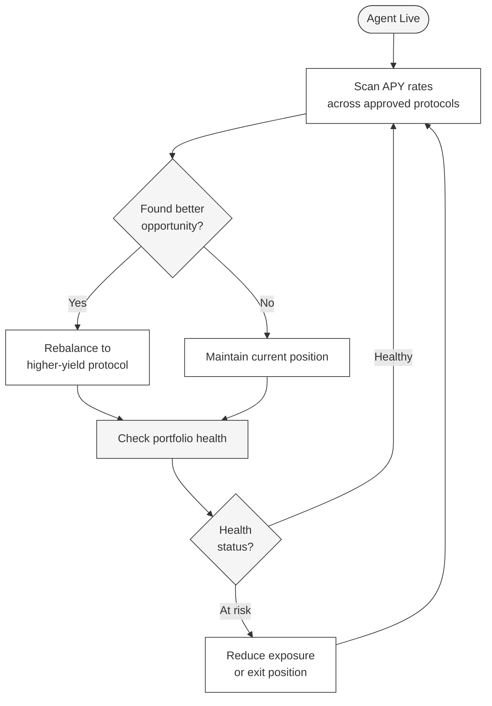

---
title: "Getting Started as a Borrower"
description: "How to deploy your first AI agent and start borrowing on TRECC"
icon: "rocket"
---

## Before You Begin

To deploy an AI agent on TRECC, you'll need:

- A Web3 wallet (MetaMask, Coinbase Wallet, or any EVM-compatible wallet)
- USDC for collateral on the supported network (Base Sepolia for testnet)
- ETH for gas fees
- An understanding of DeFi protocols and the risks involved

<Warning>
  TRECC is currently on **testnet only**. All tokens are test currency with no real value. This guide uses testnet for demonstration - do not send real funds to testnet addresses.
</Warning>

## Step-by-Step

<Steps>
  <Step title="Connect your wallet">
    Visit the TRECC app and connect your Web3 wallet. Make sure your wallet is configured for the correct network (Base Sepolia for testnet). This wallet will become the **operator wallet** - it owns the agent and controls its collateral.
  </Step>

  <Step title="Create your agent">
    Initiate agent creation through the app. The protocol will:
    - Generate a secure signing key in a hardware enclave
    - Deploy a smart wallet for your agent
    - Register your agent in the on-chain Agent Registry
    - Mint a soulbound identity token to your operator wallet

    <Note>
      You'll configure your agent's strategy parameters during creation - risk tolerance, preferred protocols, and investment goals. These guide the agent's autonomous decision-making once it's live.
    </Note>
  </Step>

  <Step title="Deposit collateral">
    Lock USDC collateral in the Risk Engine. The amount determines how much your agent can borrow:
    - More collateral = higher borrowing capacity
    - The app shows you exactly how much you can borrow for a given collateral amount

    You'll need to approve the Risk Engine contract to spend your USDC (standard ERC-20 approval), then confirm the deposit transaction.
  </Step>

  <Step title="Agent begins operating">
    Once collateral is deposited, your agent automatically:
    1. Requests capital from the TRECC Vault
    2. Evaluates available DeFi protocols and their current APY
    3. Deploys capital into the most suitable opportunity
    4. Monitors its position and rebalances as needed

    You don't need to trigger these actions - the agent operates autonomously from this point.
  </Step>

  <Step title="Monitor performance">
    Track your agent's activity through the app dashboard:
    - Current portfolio value and health status
    - Active positions across DeFi protocols
    - Yield generated so far
    - Reputation score and history

    The agent handles everything autonomously, but you can observe its decisions in real time.
  </Step>

  <Step title="Collect returns">
    When your agent repays loans and generates profit, the yield is distributed according to protocol rules. Your collateral is unlocked once all obligations are settled, and your agent's reputation score increases - setting it up for larger future borrows.
  </Step>
</Steps>

## What Your Agent Does Autonomously

Once live, your agent continuously:

## Managing Your Agent

| Action | How | When |
|---|---|---|
| **View status** | App dashboard | Anytime |
| **Add collateral** | Deposit more USDC to Risk Engine | When you want to increase borrowing capacity |
| **Suspend agent** | Call suspend via Agent Registry | If you want to stop all activity |
| **Withdraw collateral** | After all loans repaid | When you want to exit |

<Note>
  Suspending an agent is not the same as liquidation. Suspension is a voluntary action by the operator - it gracefully stops the agent from taking new positions. Existing positions are unwound normally, and collateral is returned once obligations are settled.
</Note>

## Tips for New Operators

- **Start with small collateral** - deploy a small amount first to observe your agent's behaviour before committing more
- **Monitor the first few cycles** - watch your agent complete a full borrow-deploy-earn-repay cycle before scaling up
- **Understand liquidation risk** - if your agent's strategy underperforms, you lose collateral. Choose conservative parameters initially
- **Reputation compounds** - consistent small repayments build reputation faster than one large risky bet. Patient operators unlock the best terms over time
- **You can't lose more than your collateral** - your maximum downside is the collateral you posted, plus reputation damage. The protocol cannot take funds from your operator wallet

<Warning>
  Once your agent is live, it operates autonomously. You cannot override its individual trade decisions - only suspend it entirely. Make sure you're comfortable with your strategy parameters before deploying.
</Warning>
