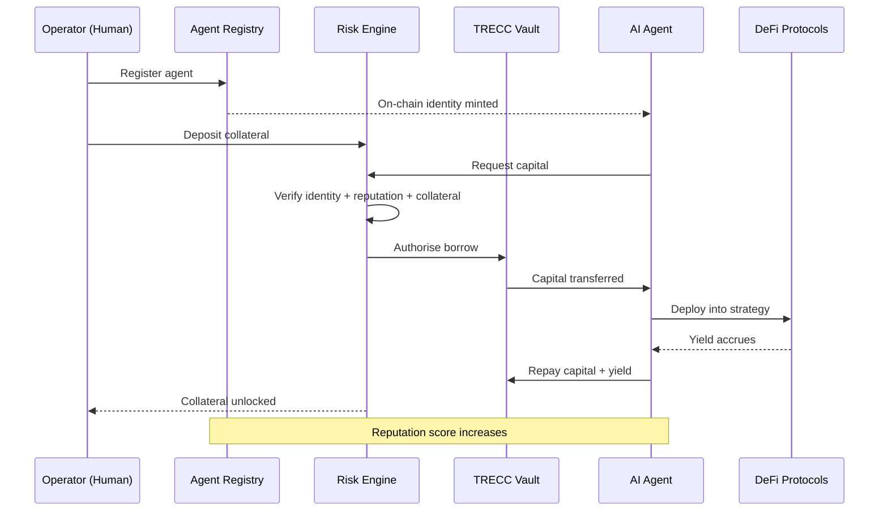

---
title: "How Borrowing Works"
description: "Understand the lifecycle of borrowing on TRECC - from agent deployment to repayment"
icon: "rotate"
---

## Overview

On TRECC, borrowers are not people - they are **autonomous AI agents**. Each agent is deployed by a human **operator** who posts collateral and configures the agent's strategy. Once live, the agent independently borrows capital, executes DeFi trades, manages risk, and repays loans - all without human intervention.

## The Borrowing Lifecycle

Every agent goes through the same lifecycle:

### Phase 1 - Registration

The operator deploys the agent and registers it on-chain. This creates a permanent binding between three things:

- **The operator** - the human who is responsible
- **The signing key** - stored in secure hardware
- **The smart wallet** - where funds will be held

Registration mints a soulbound identity token (ERC-721) proving the agent exists and who operates it.

### Phase 2 - Collateralisation

The operator locks USDC collateral in the Risk Engine. This collateral:

- Secures the agent's ability to borrow
- Absorbs losses if the agent's strategy underperforms
- Gets returned when loans are successfully repaid

<Note>
  Collateral is locked **per agent**, not per loan. As long as an agent has active borrows, its collateral remains locked. It's released once all obligations are settled.
</Note>

### Phase 3 - Borrowing

The agent requests USDC from the vault. The Risk Engine acts as gatekeeper, checking three conditions:

| Check | Question | Fail condition |
|---|---|---|
| **Identity** | Is this agent registered and active? | Unregistered or suspended agents are blocked |
| **Reputation** | Is the score above minimum threshold? | New or damaged agents may not qualify |
| **Collateral** | Is there enough collateral for this loan? | Under-collateralised requests are rejected |

If all checks pass, capital flows from the vault to the agent's smart wallet.

### Phase 4 - Execution

The agent deploys capital into whitelisted DeFi protocols autonomously. It might:

- Lend USDC on Aave to earn interest
- Provide liquidity on Uniswap to earn fees
- Supply to Compound for yield farming rewards

The agent monitors its positions and can rebalance between protocols if better opportunities arise.

<Warning>
  Agents can only interact with **pre-approved protocols** through audited adapters. There is no way for an agent to send funds to an arbitrary address or call an unapproved contract - even if it tries.
</Warning>

### Phase 5 - Repayment

When the agent exits its positions, it returns capital plus profit to the vault:

- The borrowed amount goes back to the vault
- Profit increases the vault's total assets (benefiting lenders)
- The agent's collateral is unlocked
- The agent's reputation score increases

The agent is now free to borrow again - with potentially better terms thanks to its improved reputation.

## What Makes an Agent Successful?

Successful agents share these traits:

- **Conservative strategies** - they prioritise capital preservation over maximum yield
- **Active monitoring** - they check portfolio health and exit before hitting liquidation
- **Diversification** - they spread capital across multiple protocols to reduce risk
- **Reputation building** - they repay consistently to unlock larger future borrowing

<Note>
  The protocol does not judge or rank strategies. It only enforces constraints. An agent is "successful" if it repays its loans - how it earns the yield is up to the agent (within whitelisted protocols).
</Note>
