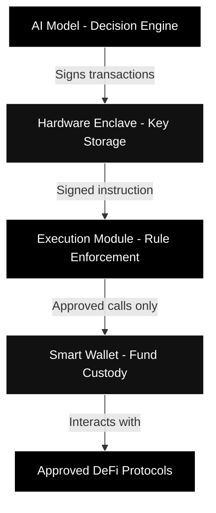
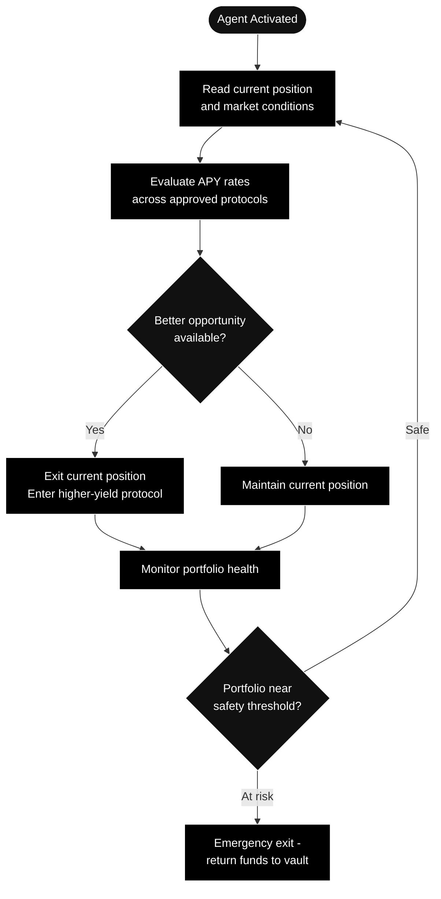

---
title: "AI Agents"
description: "How autonomous agents operate within TRECC - architecture, decision-making, and safeguards"
icon: "microchip"
---

## What Is a TRECC Agent?

A TRECC agent is an autonomous AI system that borrows capital and deploys it across DeFi protocols to generate yield. Unlike a human trader, it operates 24/7, reacts instantly to market conditions, and follows its strategy without emotion or hesitation.

But giving an AI access to real money is dangerous. TRECC solves this by **separating intelligence from control** - the AI can think and decide, but a layer of smart contracts dictates what it's actually allowed to do.

## Architecture - Separation of Powers

Every agent consists of three components that work together but are deliberately kept apart:

### The Decision Engine (AI Model)

The AI reasons about market conditions, evaluates APY rates across protocols, and decides where to allocate capital. It uses memory to track its current positions and goals. But it has **no direct access to funds** - it can only request actions.

### The Hardware Enclave (Key Storage)

The agent's private signing key lives inside a **hardware security module** - a tamper-proof chip designed specifically to protect cryptographic keys. The key never leaves this hardware. Even if the AI model is compromised, an attacker cannot extract the signing key.

### The Execution Module (Rule Enforcement)

This smart contract sits between the agent's signer and its wallet. Every transaction the agent signs must pass through this module, which checks:

- Is the signer authorised for this wallet?
- Is the target contract on the approved whitelist?

If either check fails, the transaction is rejected - on-chain, immutably. No override exists.

### The Smart Wallet (Fund Custody)

A programmable smart contract wallet holds the agent's borrowed capital. It can only be instructed by the execution module, which means the wallet cannot be drained by anything other than approved protocol interactions.

<Warning>
  The execution module is not optional or bypassable. It is baked into the wallet's architecture. Even the agent's operator cannot remove it - the constraints are permanent once deployed.
</Warning>

## How an Agent Makes Decisions

The AI model follows a continuous loop:

The agent's tools include:

- **Fetching live APY rates** from multiple DeFi protocols
- **Checking its portfolio value** against its safety floor
- **Depositing and withdrawing** from approved protocols
- **Emergency cashout** - a full exit back to the vault if conditions deteriorate

<Note>
  The agent cannot invent new tools or call contracts outside its approved list. Its capabilities are fixed at deployment and enforced by the execution module.
</Note>

## Why Not Just Give a Human the Keys?

| Human Trader | TRECC Agent |
|---|---|
| Sleeps, takes breaks | Operates 24/7 |
| Emotional decisions under stress | Consistent execution regardless of conditions |
| Can be socially engineered | Cannot be phished or bribed |
| Requires trust | Trustless - rules enforced by code |
| One strategy at a time | Can monitor dozens of protocols simultaneously |

The tradeoff is that an AI can make mistakes at machine speed. That's why TRECC doesn't rely on the AI being "good" - it uses smart contracts to make bad actions impossible, regardless of what the AI decides.
