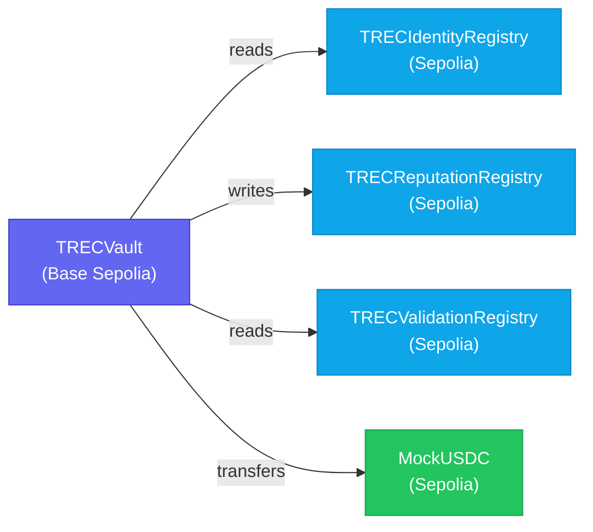

## System Overview

TRECC is a monorepo with two main packages:

| Package                 | Technology                | Role              |
| ----------------------- | ------------------------- | ----------------- |
| `TRECC_APP`             | Next.js 16 + Wagmi        | Frontend dApp     |
| `TRECC_SMART_CONTRACTS` | Hardhat + Solidity 0.8.24 | On-chain protocol |

## Contract Architecture

Four contracts form the protocol, with `TRECVault` as the central hub:

| Contract                 | Network      | Responsibility                               |
| ------------------------ | ------------ | -------------------------------------------- |
| `TRECVault`              | Base Sepolia | Lending pool, bond management, loan issuance |
| `TRECIdentityRegistry`   | Sepolia      | Soulbound NFT identity for agents            |
| `TRECReputationRegistry` | Sepolia      | On-chain credit score tracking               |
| `TRECValidationRegistry` | Sepolia      | EIP-712 KYC verification                     |
| `MockUSDC`               | Sepolia      | Test ERC-20 for lending                      |

## Frontend Stack

| Layer         | Technology                       |
| ------------- | -------------------------------- |
| Framework     | Next.js 16.1.6 (App Router)      |
| UI            | React 19.2.3 + Tailwind CSS 4    |
| Blockchain    | Wagmi 2.19.5 + Viem 2.47.4       |
| Wallet Modal  | Reown AppKit 1.8.19              |
| Data Fetching | TanStack React Query 5           |
| ENS           | Viem ENS utilities + ethers.js 6 |
| Agent Wallet  | Coinbase CDP (MPC Vault)         |

## Data Files

Two JSON files track agent state in the app:

| File             | Path                            | Description                         |
| ---------------- | ------------------------------- | ----------------------------------- |
| `agent.json`     | `TRECC_APP/data/agent.json`     | Agent identity and configuration    |
| `agent_log.json` | `TRECC_APP/data/agent_log.json` | Agent activity and interaction logs |

## Request Flow

1. **User connects wallet** via Reown AppKit (supports MetaMask, Coinbase Wallet, WalletConnect).
2. **Frontend reads** identity/reputation/KYC state from Sepolia contracts via Wagmi hooks.
3. **TRECVault on Base Sepolia** orchestrates lending issuing loans, accepting repayments, slashing bonds.
4. **Agent wallets** are Coinbase CDP MPC vaults; USDC is disbursed directly to these wallets.
5. **The TRECC app** translates user actions into the appropriate contract calls.
