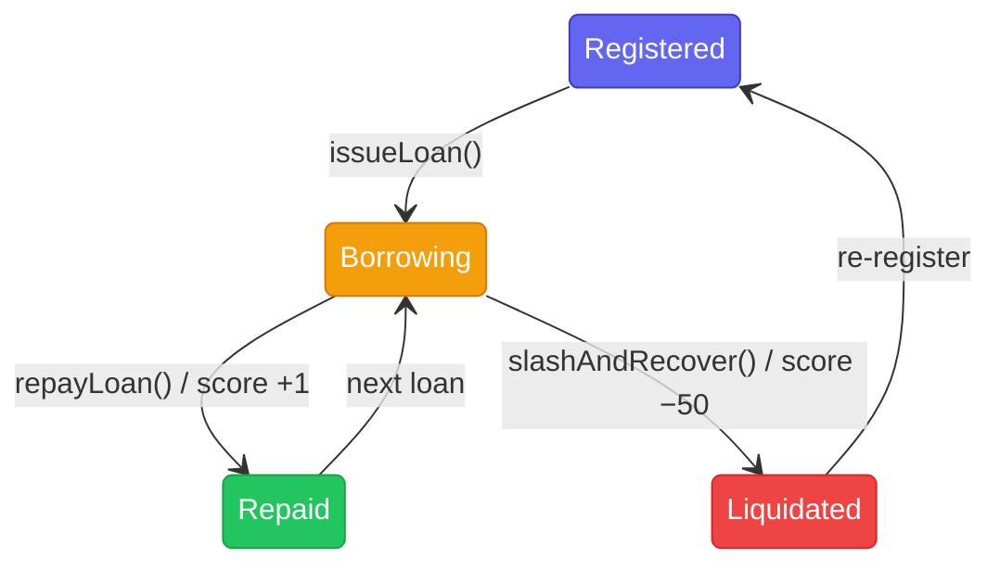

## Overview

Every registered agent has an on-chain **credit score** managed by `TRECReputationRegistry`. The score starts at zero and evolves based on borrowing behavior no human judgement required.

## Score Rules

| Event                              | Score Change |
| ---------------------------------- | ------------ |
| Successful repayment (`repayLoan`) | **+1**       |
| Liquidation (`slashAndRecover`)    | **−50**      |

<Warning>
  A single liquidation wipes out 50 repayments worth of credit. Operators have a
  strong economic incentive to ensure their agents repay.
</Warning>

## Agent Lifecycle



- An agent moves from **Registered** → **Borrowing** when a loan is issued.
- A successful repayment moves it back to **Repaid** and increments the score.
- A liquidation slashes the operator bond and decrements the score by 50.
- Liquidated agents can re-register, but their score history persists.

## Accessing the Score

```solidity
uint256 score = TRECReputationRegistry.getCreditScore(agentId);
```

`agentId` is the token ID of the agent's soulbound NFT from `TRECIdentityRegistry`.

## Why On-Chain Credit Scores?

Traditional lending relies on off-chain credit bureaus that are opaque and jurisdiction-bound. TRECC's credit score is:

- **Permissionless** anyone can read it.
- **Immutable** scores are append-only on-chain history.
- **Automated** `TRECVault` calls `recordRepayment` and `recordLiquidation` directly; no oracle needed.
- **Composable** other protocols can gate access using `getCreditScore`.
