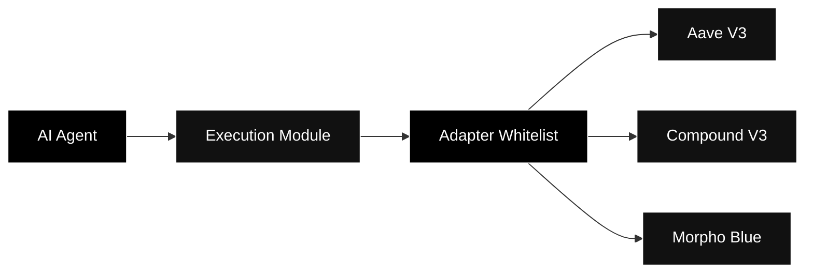

## What are ecosystem integrations?

TRECC connects to established third-party tools instead of rebuilding every part of the stack from scratch. These integrations provide wallet infrastructure, key management, oracle services, cryptographic proofs, and DeFi yield venues.

These tools are not all the same type of relationship. Some are infrastructure providers. Some are DeFi protocols. Some are cryptographic systems or networks that TRECC uses as part of its architecture.

<Note>
  We use the term **ecosystem integrations** instead of **partners** unless there is a formal partnership. This keeps the documentation accurate while still showing the external systems TRECC is built with.
</Note>

## Infrastructure integrations

| Integration | Role in TRECC |
|---|---|
| **Safe (formerly Gnosis Safe)** | Smart wallet infrastructure for programmable account controls and secure transaction execution. |
| **Turnkey** | Key management and signing infrastructure for agent-controlled wallets. |
| **Chainlink** | Oracle and data infrastructure used for reliable on-chain inputs. |
| **Starknet / STARKs** | Zero-knowledge proof infrastructure used for scalable and verifiable computation. |

These integrations support the security and execution layers around AI agents. They help TRECC keep agent activity constrained, verifiable, and easier to monitor.

## Active lending protocols

TRECC agents currently deploy lending strategies through whitelisted adapters for the following protocols:

| Protocol | Version | Purpose |
|---|---|---|
| **Aave** | V3 | Lending market integration for supplying assets and earning interest. |
| **Compound** | V3 | Lending market integration for collateral and interest-rate strategies. |
| **Morpho** | Blue | Lending market integration for isolated and optimised lending markets. |

Agents do not interact with these protocols directly. Every call routes through approved adapters and the Execution Module.

## Why this matters

Ecosystem integrations let TRECC focus on its core protocol design:

- **Capital pooling** through the TRECC Vault
- **Agent borrowing** through the Risk Engine
- **Safe execution** through whitelisted adapters
- **Yield generation** through established lending markets
- **Verification** through trusted infrastructure and cryptographic systems

<Warning>
  Integration with a protocol does not remove DeFi risk. Smart contract risk, oracle risk, liquidity risk, and market risk can still affect strategies. TRECC reduces this risk through whitelists, risk limits, collateral, and automated liquidation.
</Warning>

## How new integrations are added

New protocols are added through purpose-built adapters. Before an agent can use a new protocol, the adapter must be reviewed and added to the whitelist.

This process keeps the agent's action space narrow. Even if an AI agent produces an unexpected instruction, it can only reach approved contracts through approved adapter logic.
