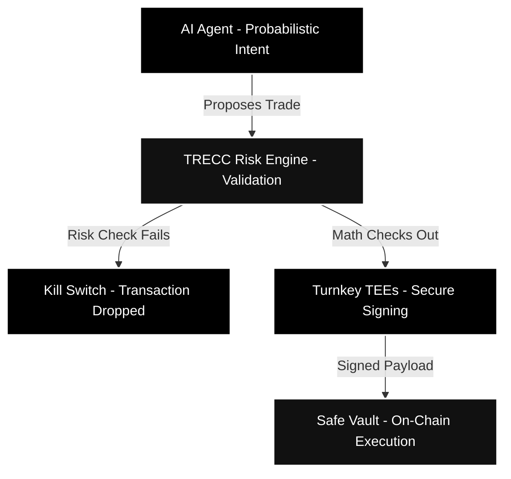
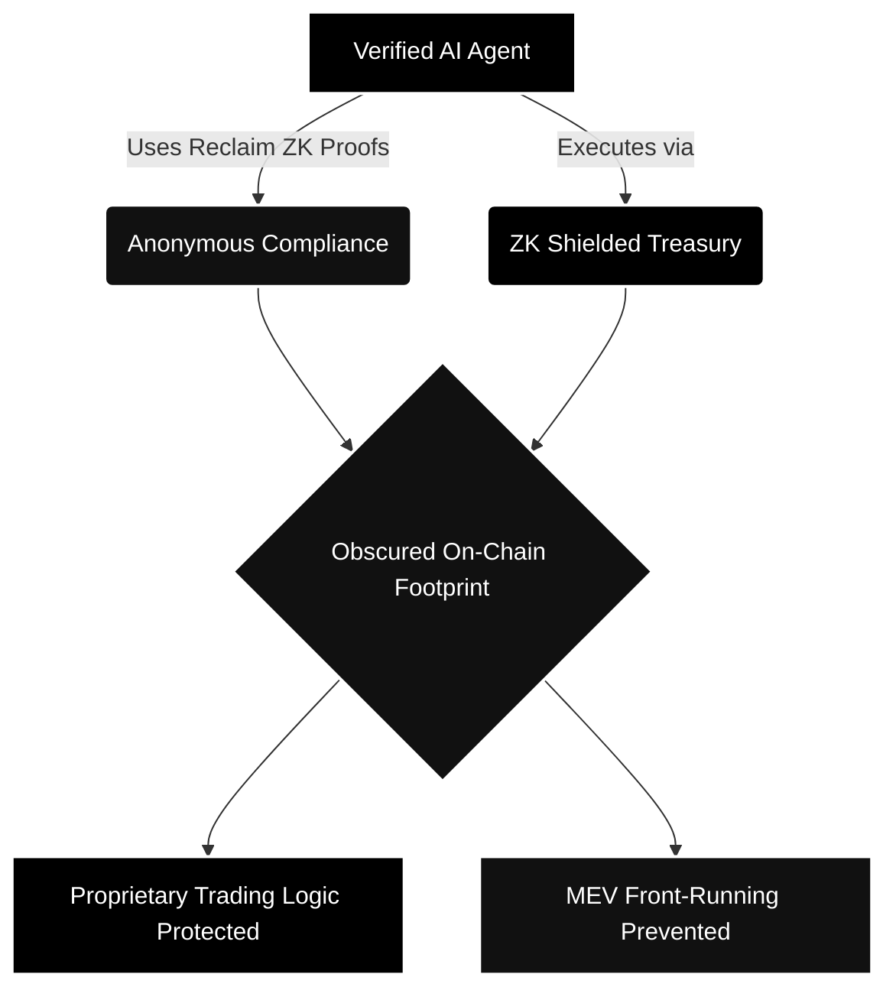

## Executive Summary

For the machine economy to scale, AI agents need the ability to hold and execute capital. However, the current "Trust Bottleneck" prevents institutional adoption: Large Language Models (LLMs) are inherently probabilistic, meaning they can guess, hallucinate, or execute trades based on stale context. 

**TRECC’s core philosophy: We do not try to fix the AI model. We secure the execution layer.**

Instead of trusting an AI not to hallucinate, TRECC intercepts the AI's financial intent and enforces **100% deterministic mathematical guardrails** before any capital ever moves. This allows agents to operate at machine speed while providing human users with absolute cryptographic certainty that their funds are safe.

---

## The Hallucination Problem

As AI agents (orchestrated via frameworks like Letta or OpenServ) transition from simple chatbots to autonomous financial actors, the stakes change dramatically. 

Giving a probabilistic model direct access to raw private keys or unconstrained capital introduces catastrophic risk. An AI might successfully execute 99 trades, but a single hallucination could cause it to drain a treasury into a compromised smart contract. 

Traditional solutions rely on "human-in-the-loop" approvals (like a manual multisig click). While safe, this defeats the purpose of an autonomous agent. Humans sleep, and human approvals are far too slow for agents operating on 2-second block times. TRECC removes the human bottleneck by replacing it with a mathematical one.

---

## The Guardrail Pipeline

When a TRECC-integrated AI agent decides to execute a trade, our infrastructure steps in. The entire evaluation process operates off-chain in milliseconds:

### 1. Intent Interception

The AI formulates a trading strategy (e.g., "Supply $5,000 USDC to Aave") and generates a transaction payload. Before this payload reaches the signing enclave, TRECC's backend intercepts the probabilistic intent.

### 2. Constraint Validation (The Risk Engine)

The requested transaction is run through our proprietary Risk Engine. The engine evaluates the payload against strict mathematical parameters set by the user or protocol, including:

* **Protocol Whitelists:** Is the target protocol verified and approved? (An agent attempting to route funds to an unknown memecoin contract will fail this check).
* **Capital Limits & Solvency:** Does the transaction size exceed the agent's staked safety bond or its dynamic TRECC credit limit?
* **Slippage & State Revalidation:** Does the current on-chain liquidity state match the AI's assumptions? If the AI is acting on 5-minute-old pricing data, the transaction is flagged.

### 3. The Kill Switch

If the AI hallucinates, attempts to interact with an unverified contract, or violates any mathematical risk parameter, the Guardrail Layer triggers an instant **Kill Switch**. Because this happens off-chain, the transaction is dropped immediately, costing the user zero gas and preventing any capital loss.

### 4. Machine-Speed Execution

If the math checks out perfectly, the payload is securely passed to **Turnkey’s Trusted Execution Environments (TEEs)**. The TEE programmatically signs the transaction in sub-100ms and routes it to the agent's **Safe (Gnosis) Vault** for rapid on-chain settlement.

---

## Verifiable Compute & Starknet STARKs

To ensure institutional-grade security without compromising on speed or privacy, TRECC's guardrails are deeply integrated with **Starknet's cryptographic infrastructure**.

We cannot process complex, multi-variable risk checks directly on the Ethereum mainnet. It is too expensive, too slow, and exposes proprietary trading constraints to front-runners. Instead, TRECC utilizes **STARK (Scalable Transparent Arguments of Knowledge)** proofs to scale safely.

```mermaid
flowchart LR
    subgraph Off_Chain [TRECC Off-Chain Environment]
        Intent[Probabilistic AI Intent] --> Risk[TRECC Risk Engine]
        Risk -->|Passes Constraints| Prover[STARK Prover]
        Prover -->|Generates Proof| Proof((STARK Proof))
    end

    subgraph Starknet_Mainnet [Starknet Execution Layer]
        Proof --> Verifier[Smart Contract Verifier]
        Verifier -->|Deterministic Verification| Execution[Safe Execution]
    end

    style Intent fill:#000000,stroke:#ffffff,color:#ffffff,stroke-width:2px
    style Risk fill:#111111,stroke:#ffffff,color:#ffffff,stroke-width:2px
    style Prover fill:#000000,stroke:#ffffff,color:#ffffff,stroke-width:2px
    style Proof fill:#111111,stroke:#ffffff,color:#ffffff,stroke-width:2px
    style Verifier fill:#000000,stroke:#ffffff,color:#ffffff,stroke-width:2px
    style Execution fill:#111111,stroke:#ffffff,color:#ffffff,stroke-width:2px
    style Off_Chain fill:none,stroke:#ffffff,color:#ffffff,stroke-dasharray: 5 5
    style Starknet_Mainnet fill:none,stroke:#ffffff,color:#ffffff,stroke-dasharray: 5 5

```

* **Off-Chain Processing:** TRECC calculates the risk parameters and validates the AI's intent off-chain, where compute is effectively free.
* **Cryptographic Proofs:** We generate a client-side STARK proof that mathematically guarantees the transaction obeys all predefined guardrails, whitelists, and credit limits.
* **On-Chain Verification:** The Starknet smart contract only needs to verify the tiny STARK proof.

By leveraging Starknet's core technology, we achieve something groundbreaking: **We turn the probabilistic guess of an AI into a deterministic, cryptographically proven action.** No transaction can be executed unless it mathematically proves its own safety.

---

## Agentic Shielding & Privacy (Roadmap)

A critical component of TRECC's long-term guardrail system is the protection of trading logic. If an AI agent's constraints and parameters are fully public, Maximum Extractable Value (MEV) bots and competitors can easily reverse-engineer the agent's strategy or front-run its trades.

To solve this, TRECC is actively building towards full **Zero-Knowledge (ZK) execution environments**. In our upcoming architectural iterations, leveraging Starknet's ZK stack will enable:

1. **Shielded Constraints:** The exact risk weights, capital limits, and proprietary constraints will remain entirely shielded from public view using client-side STARK proofs.
2. **Treasury Obfuscation:** The agent's treasury balances and transfer histories will be protected against transparent on-chain analysis, preventing predatory behavior from other market actors.
3. **Anonymous Compliance:** The underlying user backing the AI agent is verified (via Reclaim Protocol ZK proofs) but never doxed on a public ledger, maintaining full regulatory compliance without sacrificing personal privacy.