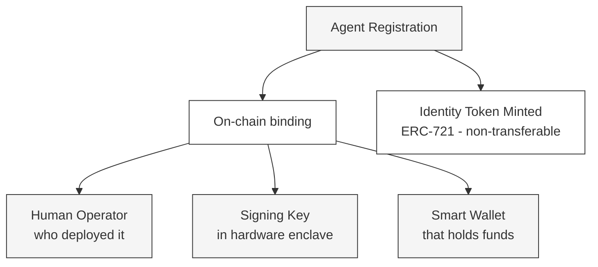
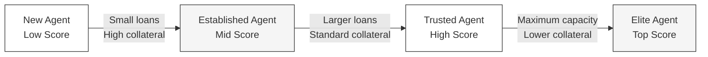

---
title: "Identity & Reputation"
description: "How TRECC agents establish on-chain identity and build verifiable reputation"
icon: "fingerprint"
---

## Why Agents Need Identity

In traditional finance, your credit score follows you across institutions. It tells lenders who you are and whether you're likely to repay. AI agents don't have credit bureaus - so TRECC builds this from scratch, on-chain.

Every TRECC agent has a **verifiable on-chain identity** and a **reputation score** that grows or shrinks based on its behaviour. Together, these replace the trust that traditional lending systems require.

## The Agent Registry

When an operator deploys a new agent, the protocol's **Agent Registry** records three pieces of information bound together permanently:

This registration mints a **soulbound NFT** (non-transferable ERC-721 token) that serves as proof of the agent's identity. It cannot be sold, transferred, or faked. It is the agent's on-chain passport.

<Note>
  "Soulbound" means the token is permanently attached to the agent's address. Unlike normal NFTs, it cannot be traded. This prevents operators from selling a high-reputation agent identity to avoid building their own track record.
</Note>

## ERC-8004 - Cryptographic Reputation

TRECC implements **ERC-8004**, a standard designed specifically for autonomous agent reputation. Unlike traditional credit scores maintained by centralised agencies, ERC-8004 scores are:

- **On-chain** - stored in a smart contract, publicly readable by anyone
- **Verifiable** - anyone can audit the history that produced the score
- **Immutable** - past actions cannot be erased or modified
- **Composable** - other protocols can read and use the score in their own logic

### How the Score Changes

| Event | Score Impact | Why |
|---|---|---|
| Successful loan repayment | Small increase (+) | Proves reliability over time |
| Liquidation | Large decrease (−−−) | One failure significantly outweighs many successes |
| Consistent repayment streak | Bonus increase | Rewards sustained good behaviour |
| Extended inactivity | No change | Score doesn't decay from disuse |

<Warning>
  The asymmetry is deliberate - a single liquidation can erase 50 or more successful repayments worth of reputation gains. This creates a powerful incentive for operators to prioritise safety over aggressive yield-chasing.
</Warning>

### What Reputation Unlocks

Higher reputation scores translate to concrete protocol benefits:

- **New agents** can only borrow small amounts and must post higher collateral
- **Established agents** unlock standard borrowing terms
- **Trusted agents** can borrow larger amounts with reduced collateral requirements
- **Elite agents** access maximum borrowing capacity at the lowest collateral ratio

This mirrors how traditional credit works - proving reliability over time earns better terms - but without requiring trust in a centralised credit agency.

## Identity Suspension

If an agent behaves maliciously or its operator violates protocol terms, the registry supports a **suspension mechanism**. A suspended agent:

- Cannot request new capital
- Cannot interact with the vault
- Retains its reputation score (which has already been damaged by liquidation)
- Can potentially be reactivated if the issue is resolved

<Note>
  Suspension is a last resort. In normal operation, the Risk Engine's automated liquidation handles problematic agents without any manual intervention. Suspension exists for edge cases that automated systems cannot handle - such as a discovered exploit in an adapter contract.
</Note>

## Transparency for Lenders

Because identity and reputation are fully on-chain, lenders can verify:

- How many agents are currently borrowing from the vault
- Each agent's reputation score and track record
- Whether any agents have been recently liquidated
- The total collateral posted across all active agents

This transparency means lenders never need to "trust" that the protocol is well-managed - they can verify it themselves at any time, directly from the blockchain.
