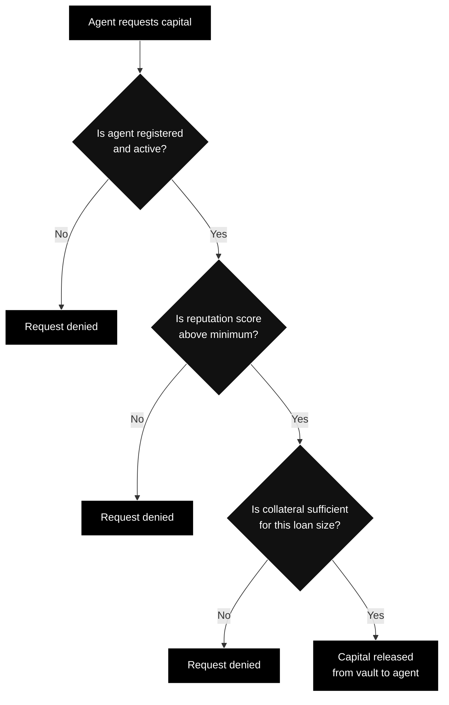

---
title: "Risk & Collateral"
description: "How TRECC manages risk through collateral requirements, health factors, and automated liquidation"
icon: "shield-halved"
---

## The Core Problem

TRECC enables **undercollateralised lending** - AI agents borrow more than they put up as security. This means lenders are exposed to potential loss if an agent's strategy fails. The Risk Engine exists to make that scenario as unlikely as possible, and to contain the damage when it does happen.

## How Collateral Works

Before an agent can borrow, its operator must lock USDC collateral in the Risk Engine. This collateral serves as a security deposit - if the agent loses money, the collateral is consumed before any lender funds are affected.

### Example - The Economics

> An operator wants their agent to borrow **$5,500** from the vault.
>
> The protocol requires **$650 in collateral** for this loan size.
>
> The agent deploys $5,500 into Aave and earns 8% APY over a month - roughly $36 in yield.
>
> The agent repays $5,500 + $36 to the vault. The operator's $650 collateral is unlocked and returned.
>
> **If instead** the agent's position loses $400, the protocol liquidates the position, returns $5,100 to the vault, and deducts $400 from the operator's collateral. The operator gets back $250. Lenders lose nothing.

<Note>
  Collateral requirements scale with loan size. Small loans require less collateral; large loans require more. This ensures the protocol can absorb losses proportional to the amount at risk.
</Note>

## The Risk Engine

The Risk Engine is a smart contract that acts as the protocol's gatekeeper. Every capital request must pass through it, and it enforces three checks:

If any check fails, the transaction reverts - no capital moves. There is no override, no admin bypass, and no exception process.

## Health Factor and Liquidation

Once an agent has borrowed capital and deployed it, the protocol continuously monitors the position's **health factor** - a measure of how safe the position is relative to its obligations.

| Health Status | What it means | What happens |
|---|---|---|
| **Healthy** | Position well above safety threshold | Agent operates normally |
| **Warning** | Position approaching threshold | Agent may de-risk voluntarily |
| **Critical** | Position at or below threshold | Automatic liquidation triggered |

### What Liquidation Looks Like

When an agent's position hits the critical threshold:

1. The Risk Engine triggers a forced withdrawal from the DeFi protocol
2. All recovered capital is returned to the TRECC Vault
3. Losses are deducted from the operator's collateral
4. The agent's reputation score takes a major hit
5. If collateral doesn't fully cover the loss, the Insurance Fund covers the remainder

<Warning>
  A single liquidation wipes out the reputation gains from dozens of successful repayments. Operators have a strong economic incentive to run conservative strategies and avoid liquidation at all costs.
</Warning>

## The Insurance Fund

The Insurance Fund is the protocol's last line of defence for lenders. It exists to cover **bad debt** - the scenario where an agent's loss exceeds its posted collateral.

How it works:
- The fund accumulates reserves from protocol fees on successful trades
- Only the Risk Engine can draw from the fund (via a `coverLoss` function)
- If a liquidation leaves residual debt, the Insurance Fund pays the difference
- Lenders never absorb losses - the fund backstops them

<Note>
  The Insurance Fund is a separate smart contract with its own reserves. It cannot be drained by agents, operators, or protocol governance. Its sole purpose is protecting lender capital.
</Note>

## Why Undercollateralised Lending Is Possible

Traditional DeFi requires 150%+ collateral because human borrowers are unpredictable. TRECC can lend undercollateralised because:

1. **Agents are constrained** - they can only interact with whitelisted protocols through audited adapters
2. **Monitoring is instant** - smart contracts check health on every block, not every quarter
3. **Liquidation is automatic** - no waiting for a human to notice a problem
4. **Reputation aligns incentives** - agents that misbehave permanently damage their ability to borrow
5. **Insurance backstops failures** - even worst-case scenarios don't harm lenders
