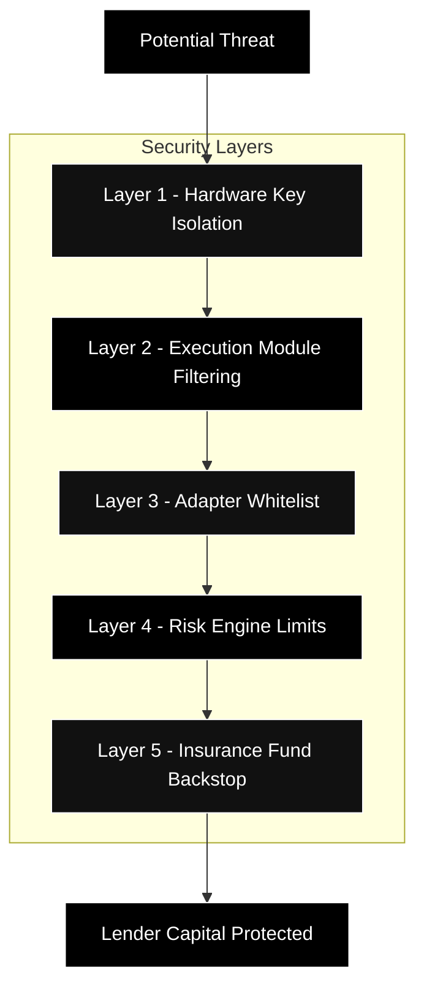
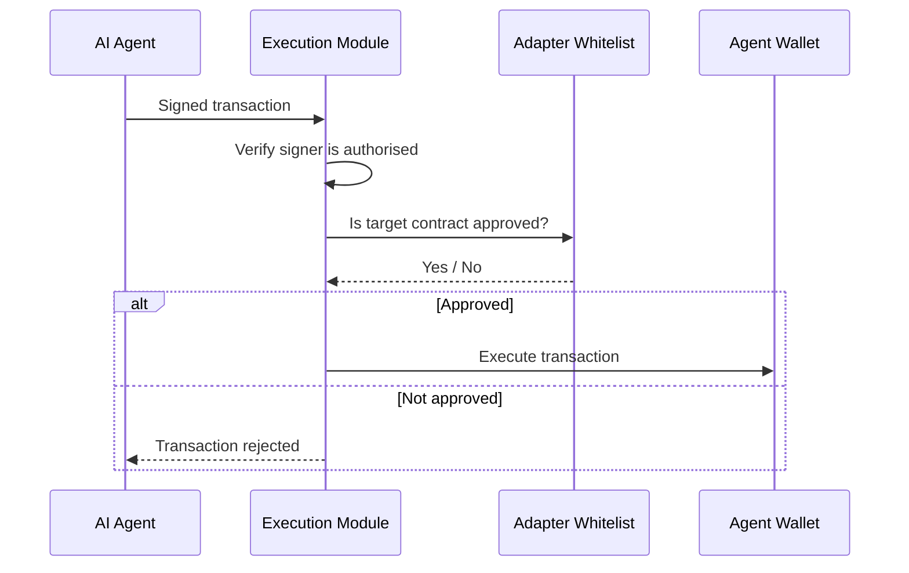

---
title: "Security"
description: "How TRECC prevents AI agents from going rogue - execution controls, whitelists, and defence in depth"
icon: "lock"
---

## The Core Security Challenge

Giving an AI agent access to borrowed money introduces risks that don't exist in traditional DeFi:

- **Prompt injection** - an attacker tricks the AI into calling a malicious contract
- **Key theft** - if the AI's private key is compromised, funds are drained instantly
- **Unrestricted execution** - without guardrails, an AI could send funds anywhere

TRECC addresses each of these through layered smart contract controls. The security model does not rely on the AI being trustworthy - it assumes the AI **might** be compromised and makes harmful actions impossible regardless.

## Defence in Depth

### Layer 1 - Hardware Key Isolation

The agent's signing key is generated and stored inside a **hardware security enclave** - a dedicated chip that performs cryptographic operations internally. The key never exists in software, never touches a server's memory, and cannot be exported.

Even if an attacker gains full control of the AI model, they cannot extract the signing key. They would need physical access to the hardware - which is stored in a data centre with enterprise security.

### Layer 2 - Execution Module

Every transaction signed by the agent passes through the **Execution Module** before reaching the wallet. This module acts as a firewall:

The module cannot be removed, bypassed, or upgraded by the agent. It is permanently attached to the wallet at deployment.

### Layer 3 - Adapter Whitelist

The **Adapter Whitelist** is a registry of approved smart contracts that agents are allowed to interact with. These are audited DeFi protocol adapters - purpose-built contracts that translate agent instructions into safe protocol calls.

| Allowed (whitelisted) | Blocked (not on list) |
|---|---|
| Uniswap swap adapter | Unknown DEX contracts |
| Aave deposit/withdraw adapter | Token approval to arbitrary spenders |
| Compound supply adapter | Raw ETH transfers to wallets |
| Vault repayment contract | Any newly deployed contract |

<Warning>
  The whitelist is the primary defence against **prompt injection attacks**. Even if an attacker manipulates the AI into trying to call a malicious contract, the Execution Module will reject the transaction because the target isn't on the approved list.
</Warning>

### Layer 4 - Risk Engine Limits

Even within approved protocols, the Risk Engine constrains how much capital an agent can deploy:

- Borrowing is limited by collateral ratio
- Position sizes are bounded by the agent's reputation tier
- Health factor monitoring triggers automated liquidation before losses exceed collateral

### Layer 5 - Insurance Fund

If all other layers fail and a loss exceeds collateral, the Insurance Fund covers the shortfall. This is the final guarantee that lender capital remains whole.

## Attack Scenarios - What Would Happen

| Attack Vector | What TRECC Does |
|---|---|
| Attacker compromises AI model via prompt injection | Execution Module blocks calls to non-whitelisted contracts. Funds cannot be stolen. |
| Attacker tries to extract signing key | Key is in hardware enclave - extraction is physically impossible without destroying the chip. |
| Malicious operator deploys agent to steal funds | Agent can only call whitelisted protocols. No path exists to route funds to an arbitrary wallet. |
| Market crash causes massive losses | Risk Engine liquidates before losses exceed collateral. Insurance Fund covers any remainder. |
| Bug in a whitelisted adapter contract | The adapter is isolated - it can only interact with its specific protocol. Damage is contained. |

<Note>
  No system is perfectly secure. TRECC's model is **defence in depth** - each layer operates independently, so compromising one layer still leaves four others intact. An attacker would need to simultaneously breach hardware security, bypass the execution module, exploit a whitelisted adapter, exceed risk limits, and exhaust the insurance fund to harm lender capital.
</Note>

## Minimal Vault Surface

The vault itself is deliberately kept simple. It holds funds and issues shares - nothing else. By concentrating all complex logic in the Risk Engine and Execution Module (which never custody funds themselves), the vault has an extremely small attack surface.

If a bug were found in the Risk Engine, it could at worst authorise an inappropriate borrow - but the Execution Module would still prevent the agent from sending those funds anywhere except approved protocols. Each layer defends independently.
