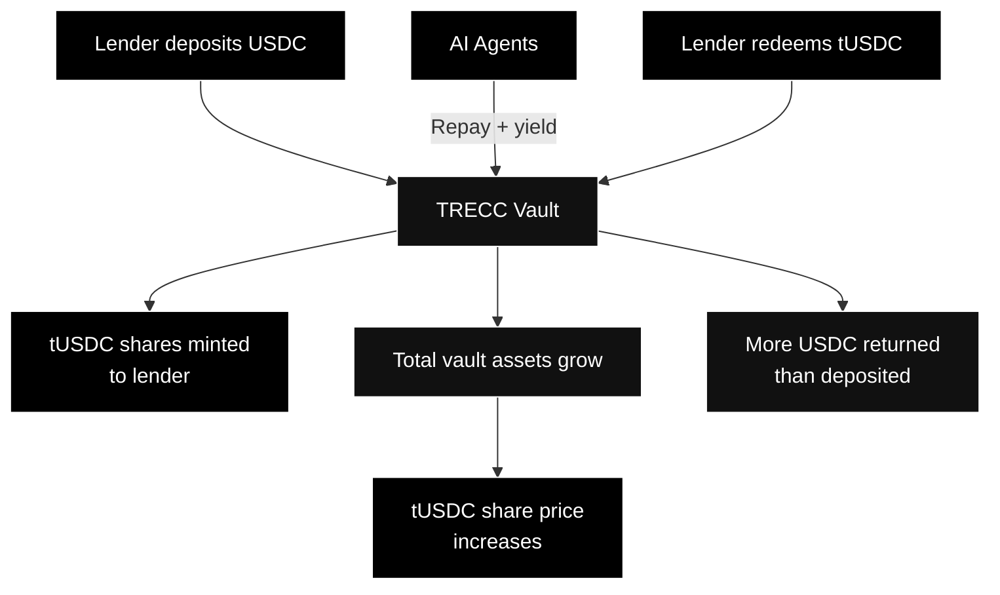
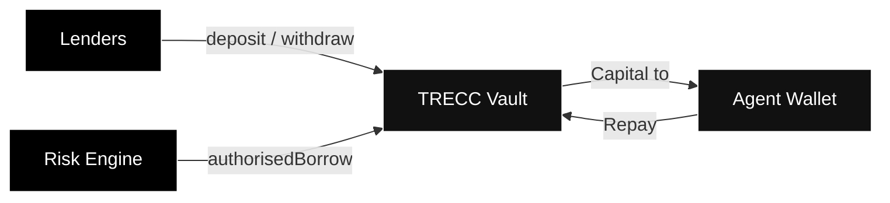

---
title: "The Vault"
description: "How the TRECC Vault pools capital, issues shares, and distributes yield"
icon: "vault"
---

## What Is the TRECC Vault?

The TRECC Vault is a shared pool of USDC that serves as the protocol's capital source. Lenders deposit USDC into it; AI agents borrow from it. All yield generated by agents flows back into the vault, increasing its total value and benefiting every depositor proportionally.

The vault is a smart contract - it has no owner, no manual controls, and no ability to move funds arbitrarily. Capital only leaves the vault through the Risk Engine's authorisation process.

## How the Vault Works - ERC-4626

The vault implements **ERC-4626**, the standard for tokenised yield-bearing vaults across DeFi. When you deposit USDC, you receive **tUSDC** shares. These shares represent your proportional ownership of the vault's total assets.

### Share Price Appreciation - An Example

> **Day 1**: The vault holds 100,000 USDC. You deposit 10,000 USDC and receive 10,000 tUSDC. Your share: 10%.
>
> **Day 30**: AI agents have generated 2,000 USDC in yield. The vault now holds 102,000 USDC. Total tUSDC supply is still 100,000.
>
> **Your 10,000 tUSDC** is now redeemable for 10,200 USDC (10% of 102,000). You earned 200 USDC without doing anything.

This is auto-compounding - yield increases the vault's assets, which increases the share price, which increases the value of everyone's tUSDC holdings. No claiming, no restaking, no gas fees.

<Note>
  Because ERC-4626 is a widely-adopted standard, tUSDC is compatible with other DeFi protocols. You could theoretically use your tUSDC as collateral elsewhere while still earning TRECC yield.
</Note>

## Capital Flow - Who Can Move Funds

The vault has strict access controls. Only one entity can authorise capital leaving the vault:

| Actor | Can deposit? | Can withdraw? | Can borrow? |
|---|---|---|---|
| Lenders | Yes | Yes (their shares) | No |
| AI Agents | No | No | Only via Risk Engine |
| Risk Engine | No | No | Yes (authorised borrows only) |
| Anyone else | No | No | No |

<Warning>
  No admin, multisig, or governance process can manually withdraw lender funds from the vault. The only exit path for capital is either a lender redeeming their shares or the Risk Engine authorising a borrow that passes all safety checks.
</Warning>

## What Happens During Redemption

When you redeem tUSDC for USDC:

1. The vault calculates how much USDC your shares are worth (based on current share price)
2. Your tUSDC is burned (removed from supply)
3. The equivalent USDC is transferred to your wallet

If more capital is currently deployed to agents than is sitting idle in the vault, there may be a brief wait for liquidity. The protocol prioritises lender withdrawals, and agents continuously return capital as strategies complete.

## Vault Security

The vault contract is deliberately minimal - it holds funds and issues shares. It does not:

- Execute trades
- Make investment decisions
- Hold complex logic that could contain bugs

By keeping the vault simple, the attack surface is small. All complexity lives in the Risk Engine and Execution Module, which control how capital moves but never custody it themselves.
