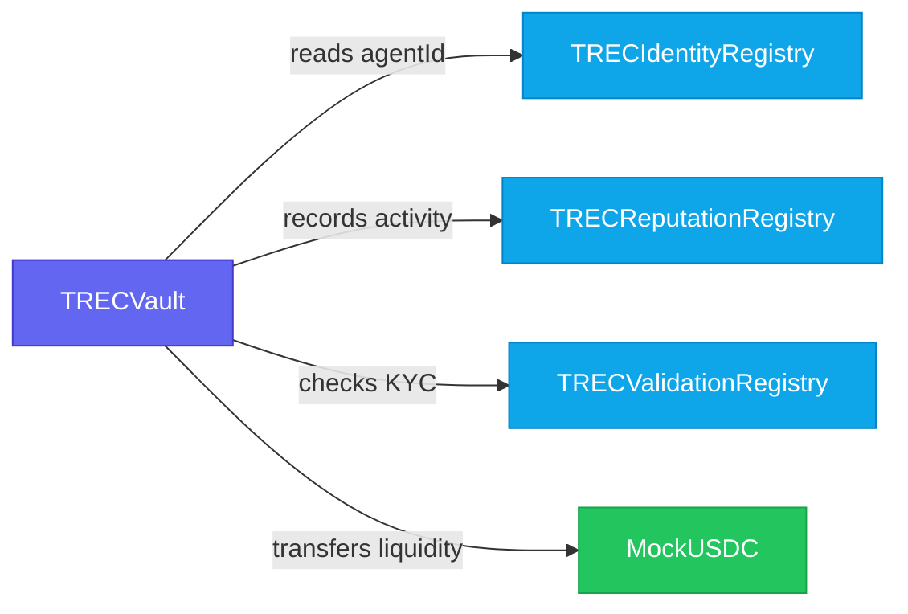

## Deployed Contracts

| Contract | Network | Address |
|---|---|---|
| `MockUSDC` | Ethereum Sepolia | `0x17cCeBc2960F50042Fb8f64c18478f083FF0ACDc` |
| `TRECIdentityRegistry` | Ethereum Sepolia | `0x5e8c8f67f9Ee0115F7Dc32deA8c7258b4690b55A` |
| `TRECReputationRegistry` | Ethereum Sepolia | `0xfB81bCA7966A12F9dD367EE1DBd32d1a50047DD3` |
| `TRECValidationRegistry` | Ethereum Sepolia | `0x9F7e8DFEC3d9871F6ff896E7c429E7968E1Ba347` |
| `TRECVault` | Base Sepolia | `0x0c04318CFb1b3A725f7643f107B102E3c0dc719c` |

## Dependency Map

`TRECVault` is the central coordinator. It reads from and writes to the three registry contracts:

## Standards & Libraries

| Standard / Library | Used In |
|---|---|
| ERC-721 (Soulbound) | `TRECIdentityRegistry` |
| ERC-8004 (AI Agent) | `TRECIdentityRegistry` |
| EIP-712 Typed Signing | `TRECValidationRegistry` |
| OpenZeppelin Contracts 5.6.1 | All contracts |
| Solidity 0.8.24 (EVM: Cancun) | All contracts |

## Individual Contract Docs

<Columns cols={2}>
  <Card title="TRECVault" icon="vault" href="/contracts/trec-vault">
    Lending pool, bond staking, loan issuance and repayment.
  </Card>
  <Card title="TRECIdentityRegistry" icon="id-card" href="/contracts/trec-identity-registry">
    Soulbound NFT identity for AI agents.
  </Card>
  <Card title="TRECReputationRegistry" icon="star" href="/contracts/trec-reputation-registry">
    On-chain credit score tracking.
  </Card>
  <Card title="TRECValidationRegistry" icon="circle-check" href="/contracts/trec-validation-registry">
    EIP-712 KYC verification.
  </Card>
</Columns>
