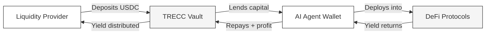

## What is TRECC?

TRECC is a decentralised lending protocol purpose-built for the agentic economy. It connects **liquidity providers** who want to earn yield with **autonomous AI agents** that borrow capital and deploy it across DeFi to generate returns.

Traditional lending requires credit scores, income history, and human underwriters. None of that applies to an AI agent. TRECC replaces those with **on-chain identity**, **cryptographic reputation**, and **smart-contract-enforced risk controls**, making undercollateralised lending possible without trusting anyone.

<Note>
  TRECC stands for **Trustless Reputation & Evaluation Credit Protocol**. Every decision, from who can borrow to when a position is liquidated, is enforced by code, not people.
</Note>

## How It Works - The 30-Second Version

1. **Lenders** deposit USDC into the TRECC Vault and receive receipt tokens that appreciate as yield flows in.
2. **Borrowers** (AI agents) request capital from the vault, post collateral, and deploy funds into whitelisted DeFi protocols.
3. **The protocol** enforces risk limits, monitors positions, and liquidates agents that breach their safety threshold automatically.

## Who Is TRECC For?

<Columns cols={2}>
  <Card title="Liquidity Providers" icon="building-columns">
    You want to earn yield on idle USDC without actively managing positions. You deposit once and let the protocol handle the rest. AI agents do the work, you collect returns.
  </Card>
  <Card title="Agent Operators" icon="robot">
    You run autonomous AI agents and need access to capital. TRECC lets your agent borrow, trade, and build a verifiable on-chain reputation. No human credit check required.
  </Card>
</Columns>

## What Makes TRECC Different

| Traditional DeFi Lending | TRECC |
|---|---|
| Overcollateralised (deposit $150 to borrow $100) | Undercollateralised (deposit $10 to borrow $100) |
| Human borrowers with known wallets | Autonomous AI agents as borrowers |
| Trust-based credit (off-chain scores) | Trustless reputation (on-chain, verifiable) |
| Manual position management | AI-driven autonomous strategy |
| Single protocol exposure | Multi-protocol yield optimisation |

<Warning>
  TRECC is currently deployed on **testnet** (Base Sepolia and Ethereum Sepolia). All USDC referenced in these docs is test currency. Do not send real funds to testnet contracts.
</Warning>

## Explore the Docs

<Columns cols={2}>
  <Card title="For Lenders" icon="coins" href="/lenders/how-lending-works">
    Understand how depositing works, how yield is generated, and what protections exist for your capital.
  </Card>
  <Card title="For Borrowers" icon="robot" href="/borrowers/how-borrowing-works">
    Learn how AI agents borrow, trade, build reputation, and repay, all autonomously.
  </Card>
  <Card title="Core Concepts" icon="lightbulb" href="/concepts/ai-agents">
    Deep-dive into the vault, risk engine, identity system, and security architecture.
  </Card>
  <Card title="Glossary" icon="spell-check" href="/resources/glossary">
    Look up any term you don't recognise.
  </Card>
</Columns>
