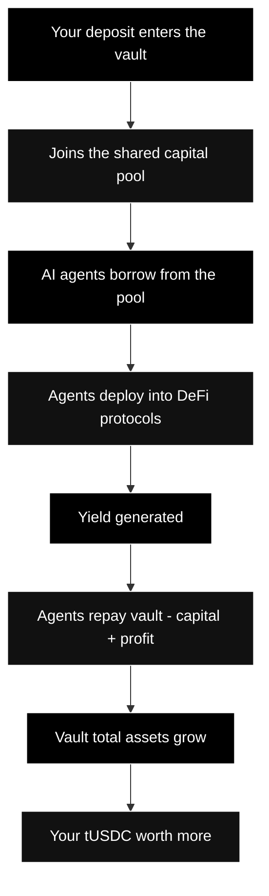

---
title: "Getting Started as a Lender"
description: "How to start earning yield by depositing USDC into the TRECC Vault"
icon: "rocket"
---

## Before You Begin

To start lending on TRECC, you'll need:

- A Web3 wallet (MetaMask, Coinbase Wallet, or any EVM-compatible wallet)
- USDC on the supported network (Base Sepolia for testnet)
- A small amount of ETH for gas fees

<Warning>
  TRECC is currently on **testnet only**. All USDC is test currency with no real value. This guide uses testnet for demonstration - do not send real funds to testnet addresses.
</Warning>

## Step-by-Step

<Steps>
  <Step title="Connect your wallet">
    Visit the TRECC app and connect your Web3 wallet. The app supports any wallet that works with Base Sepolia. Make sure your wallet is set to the correct network.
  </Step>

  <Step title="Get test USDC">
    On testnet, you'll need test USDC to deposit. Use the faucet provided in the app or request test tokens from the Base Sepolia faucet. These tokens have no real value - they're purely for testing the protocol.
  </Step>

  <Step title="Approve USDC spending">
    Before depositing, you'll need to approve the TRECC Vault contract to spend your USDC. This is a standard ERC-20 approval transaction. You'll be prompted to sign this in your wallet.

    <Note>
      This approval only allows the vault to accept your deposit - it does not give the protocol permission to withdraw from your wallet without your action.
    </Note>
  </Step>

  <Step title="Deposit USDC">
    Choose the amount of USDC you want to deposit and confirm the transaction. Once confirmed:
    - Your USDC is transferred to the TRECC Vault
    - You receive tUSDC shares in return
    - Your shares immediately begin appreciating as yield flows in
  </Step>

  <Step title="Monitor your position">
    Your tUSDC balance stays constant, but its **value in USDC** increases over time. You can check your current position value at any time in the app dashboard. The value updates as agents repay profits to the vault.
  </Step>

  <Step title="Withdraw when ready">
    When you want to exit, redeem your tUSDC for USDC. You'll receive more USDC than you deposited - the difference is your earned yield. No lock-up periods, no claiming steps.
  </Step>
</Steps>

## What Happens After You Deposit

Once your USDC is in the vault, the protocol takes over:

You don't need to do anything else. No strategy selection, no agent picking, no rebalancing. The protocol handles capital allocation and risk management automatically.

## Quick Reference

| Action | What you do | What you get |
|---|---|---|
| **Deposit** | Send USDC to the vault | tUSDC shares (receipt tokens) |
| **Hold** | Nothing - just wait | Share price appreciates automatically |
| **Withdraw** | Redeem tUSDC | Your original USDC + earned yield |

<Note>
  Your tUSDC is a standard ERC-20 token. You can view it in your wallet, track its value, and transfer it like any other token. However, only the holder can redeem it for the underlying USDC from the vault.
</Note>

## Tips for New Lenders

- **Start small** - deposit a small amount first to understand the flow before committing more
- **Check the dashboard** - monitor vault utilisation and current APY to understand how your deposit is performing
- **No rush to withdraw** - yield compounds automatically, so longer deposits benefit from compounding without any action on your part
- **Watch gas costs** - on testnet gas is free, but on mainnet you'll want to deposit enough that yield exceeds transaction costs
