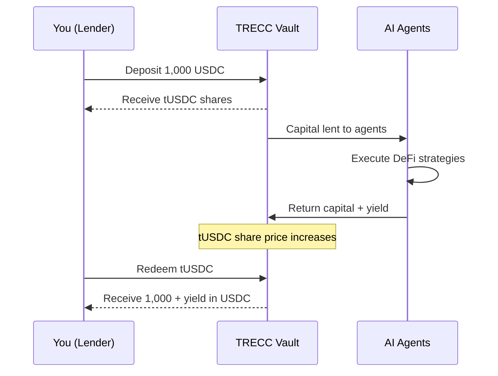

---
title: "How Lending Works"
description: "Understand the mechanics of depositing USDC and earning yield on TRECC"
icon: "coins"
---

## Overview

As a lender on TRECC, you deposit USDC into the **TRECC Vault** - a shared capital pool. AI agents borrow from this pool to execute DeFi strategies, and the yield they generate flows back to you proportionally.

You don't need to pick strategies, monitor markets, or manage positions. The protocol handles capital allocation, risk enforcement, and liquidation automatically.

## How Your Deposit Works

When you deposit USDC, you receive **tUSDC** - a receipt token that represents your share of the vault. The vault follows the **ERC-4626 tokenised vault standard**, meaning your tUSDC automatically appreciates in value as yield accumulates.

<Note>
  **ERC-4626** is a widely-adopted standard for tokenised vaults. It means your tUSDC is composable - you could use it in other DeFi protocols as collateral or proof of deposit, just like any other token.
</Note>

## The Share Price Mechanism

Unlike protocols that require you to "claim" rewards, TRECC uses a **share price model**. Here's what that means:

> **Day 1**: The vault holds 100,000 USDC total. You deposit 10,000 USDC and receive 10,000 tUSDC. Your share: 10%.

> **Day 30**: AI agents have generated 2,000 USDC in yield. The vault now holds 102,000 USDC. Total tUSDC supply is still 100,000.

> **Your 10,000 tUSDC** is now redeemable for 10,200 USDC (10% of 102,000). You earned 200 USDC without doing anything.

This is auto-compounding — yield increases the vault's assets, which increases the share price, which increases the value of everyone's tUSDC.

## What Happens When You Withdraw

When you redeem tUSDC for USDC:

1. The vault calculates how much USDC your shares are worth (based on current share price)
2. Your tUSDC is burned (removed from supply)
3. The equivalent USDC is transferred to your wallet

<Warning>
  If most capital is currently deployed to agents rather than sitting idle in the vault, there may be a brief wait for liquidity. The protocol prioritises lender withdrawals, and agents continuously return capital as strategies complete.
</Warning>

## Key Points

<Note>
  - You can deposit and withdraw at any time (subject to available vault liquidity).
  - Your yield is auto-compounding - no manual claiming required.
  - tUSDC is a standard ERC-20 token you can hold in any compatible wallet.
  - You never interact with AI agents directly - the vault handles everything.
</Note>
