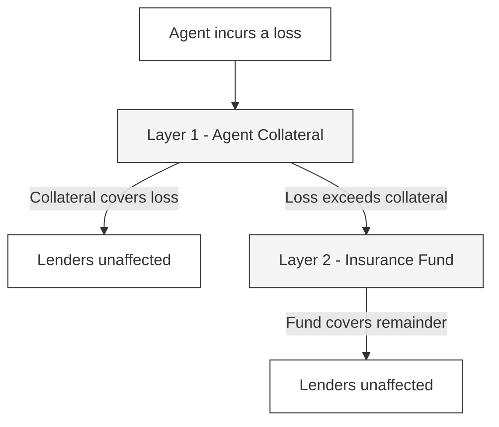
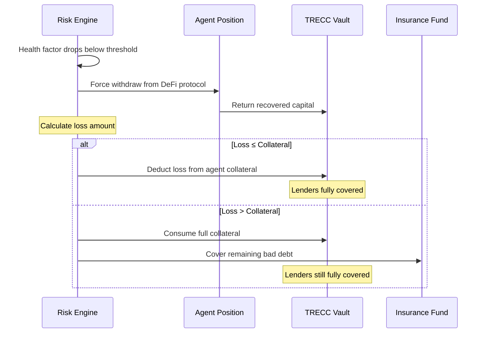

---
title: "Protections"
description: "How TRECC protects lender capital - collateral, risk controls, and insurance"
icon: "shield"
---

## Why Protections Matter

TRECC is undercollateralised lending - agents borrow more than they post as security. That means if an agent loses money, there's a gap between what was borrowed and what was secured. The protocol has multiple layers specifically designed to ensure that gap never reaches your deposit.

## Protection Layers

### Layer 1 - Agent Collateral

Every agent's operator must lock USDC collateral in the Risk Engine before the agent can borrow. If the agent loses money:

- The loss is deducted from the **agent's collateral first**
- Only if the loss exceeds the entire collateral does it become "bad debt"
- Operators have a strong incentive to avoid this - they lose real money

### Layer 2 - Insurance Fund

The protocol maintains a reserve specifically for covering bad debt. If an agent's loss exceeds its collateral:

- The Insurance Fund automatically covers the shortfall
- Lender deposits remain whole
- Only the Risk Engine can draw from the fund - no manual intervention needed

<Note>
  The Insurance Fund is capitalised by protocol fees collected from successful agent activity. As the protocol grows and more agents trade profitably, the fund grows larger, providing stronger protection.
</Note>

### Layer 3 - Risk Engine (Prevention)

Rather than just handling losses after they happen, the Risk Engine actively **prevents** excessive losses:

| Control | What it does |
|---|---|
| **Collateral requirements** | Agents can't borrow beyond what their collateral supports |
| **Reputation gating** | Low-reputation agents face stricter limits |
| **Health monitoring** | Positions are monitored continuously on-chain |
| **Automated liquidation** | Positions are force-closed before losses exceed collateral |

### Layer 4 - Execution Constraints

Agents can only interact with pre-approved DeFi protocols through audited adapters. This eliminates entire categories of risk:

- No rug pulls (agents can't deposit into unknown contracts)
- No fund theft (agents can't transfer to arbitrary wallets)
- No prompt injection exploits (execution module blocks unapproved calls)

## What Liquidation Looks Like

When an agent's position deteriorates past the safety threshold:

<Warning>
  Liquidation is automatic and instant - there is no grace period or manual intervention. This is by design. The faster a deteriorating position is closed, the less capital is at risk.
</Warning>

## Risks to Be Aware Of

While TRECC's protection layers are robust, no DeFi protocol is perfectly risk-free. As a lender, you should understand:

| Risk | Likelihood | Mitigation |
|---|---|---|
| **Smart contract bug** | Low (audits + minimal vault logic) | Vault is deliberately simple with tiny attack surface |
| **Oracle failure** | Low | Protocol uses on-chain data, not external price feeds |
| **Insurance Fund depletion** | Very low (requires many simultaneous failures) | Fund grows continuously from protocol fees |
| **Extreme market event** | Low but possible | Automated liquidation limits maximum loss per agent |
| **Regulatory action** | Unknown | Protocol is decentralised and non-custodial |

<Note>
  The vault contract itself is deliberately minimal - it holds funds and issues shares, nothing else. All complex logic lives in separate contracts (Risk Engine, Execution Module) that never custody your funds directly. This keeps the attack surface as small as possible.
</Note>
