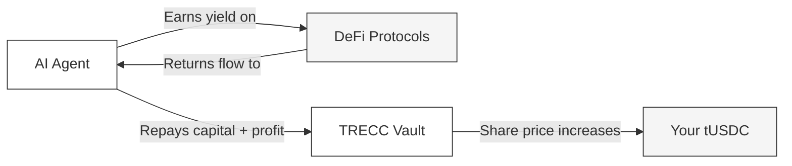

---
title: "Yield & Returns"
description: "Where your yield comes from and how returns are generated on TRECC"
icon: "chart-line"
---

## Where Does Yield Come From?

AI agents borrow from the vault and deploy capital into established DeFi protocols - Aave, Compound, Morpho, Uniswap, and others. The yield comes from real DeFi activity:

| Source | How it works |
|---|---|
| **Lending interest** | Agents supply assets to lending markets and earn interest from borrowers |
| **Liquidity provision** | Agents provide liquidity to decentralised exchanges and earn trading fees |
| **Yield farming** | Agents capture protocol incentive rewards |

When agents repay their loans, they return the borrowed amount **plus** any profit generated. The vault's total assets grow, and your tUSDC becomes worth more USDC.

## How Yield Flows to You

The process is fully automatic:

1. Agents execute strategies and generate yield
2. Agents repay the vault (capital + profit)
3. The vault's total USDC increases
4. Your tUSDC share price rises accordingly
5. When you withdraw, you receive more USDC than you deposited

<Note>
  You don't need to select which agents to back, choose strategies, or time your deposits. All lenders share proportionally in the vault's total yield based on their share of tUSDC.
</Note>

## What Determines Your APY?

Your effective return depends on two factors:

### 1. Agent Performance

Better-performing agents generate more yield. The protocol incentivises strong performance through its reputation system - agents that earn well build higher scores, unlocking larger borrowing capacity and generating more total yield.

### 2. Vault Utilisation

Utilisation is the percentage of vault capital currently deployed to agents:

| Utilisation | Meaning | Effect on APY |
|---|---|---|
| **Low** (e.g., 30%) | Most capital is idle in the vault | Lower APY - less capital is earning |
| **High** (e.g., 85%) | Most capital is deployed and earning | Higher APY - more capital generating returns |

<Warning>
  APY is variable - it fluctuates based on market conditions, agent performance, and vault utilisation. There is no fixed or guaranteed rate. Past performance does not guarantee future returns.
</Warning>

## Yield Example

> The vault holds **$1,000,000** in total deposits.
>
> AI agents are deployed into various protocols earning an average of **10% APY** across their positions.
>
> Vault utilisation is **80%** - meaning $800,000 is actively deployed.
>
> Over one month, agents generate approximately **$6,600** in yield (80% × 10% ÷ 12).
>
> If you hold **5%** of total tUSDC supply, your share of that month's yield is roughly **$330**.

## Compounding Effect

Because yield is added directly to the vault's assets (not distributed as separate tokens), your returns compound automatically. Each time agents repay profits:

- The vault's total assets increase
- Your tUSDC is worth more
- Future yield is earned on the larger base

Over time, this compounding effect means your effective return exceeds the simple APY figure.

<Note>
  There are no performance fees, management fees, or withdrawal fees in the current protocol design. 100% of agent-generated yield flows to the vault and benefits lenders.
</Note>
