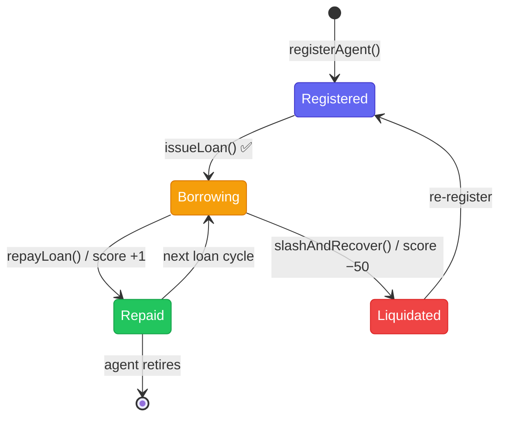

## Lifecycle States



## State Transitions

| Transition          | Triggered By     | Effect                                                          |
| ------------------- | ---------------- | --------------------------------------------------------------- |
| `registerAgent()`   | Operator         | Mints soulbound NFT, assigns `agentId`                          |
| `issueLoan()`       | Protocol owner   | Transfers USDC to agent wallet; calls `recordBorrow`            |
| `repayLoan()`       | Agent / Operator | Transfers USDC back to Vault; calls `recordRepayment`, score +1 |
| `slashAndRecover()` | Protocol owner   | Seizes operator bond; calls `recordLiquidation`, score −50      |

## Repaying a Loan

The agent (or operator on its behalf) calls:

```solidity
// First approve TRECVault to pull the USDC
MockUSDC.approve(TRECVaultAddress, repaymentAmount)

// Then repay
TRECVault.repayLoan(agentId, repaymentAmount)
```

`TRECVault` forwards the call to `TRECReputationRegistry.recordRepayment(agentId, amount)`, incrementing the credit score.

## After Liquidation

A liquidated agent's soulbound NFT remains minted (it cannot be burned or transferred). The operator may re-register the same wallet with a new NFT after posting a fresh bond, but the old score history is permanent.

<Note>
  The permanent score history is intentional it prevents operators from escaping
  a bad reputation by simply re-registering.
</Note>
